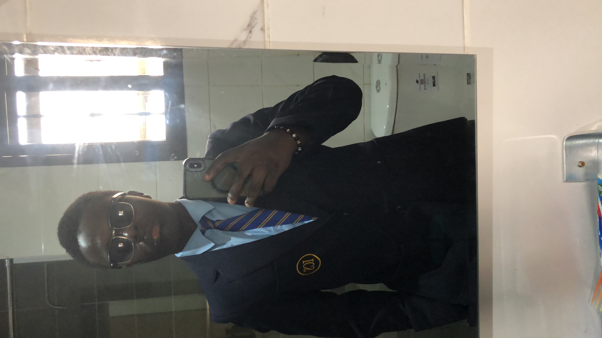

 
# Activities

## Sporting Activities
I play volleyball as a sport, and I'm on the school's volleyball team.

## School Activites
I'm in the AI & Robotics club. In the club we discuss the use of machines in society (benefits and disadvantages), or any ideas we have regarding technology through presentations made by every participant of the club. I've made a presentation on an idea that I had to improve the way aircraft send information to the control surfaces. We also build our own robots using Engino, and recently I started trying to use Circuit boards(like an Arduino) to light up bulbs.