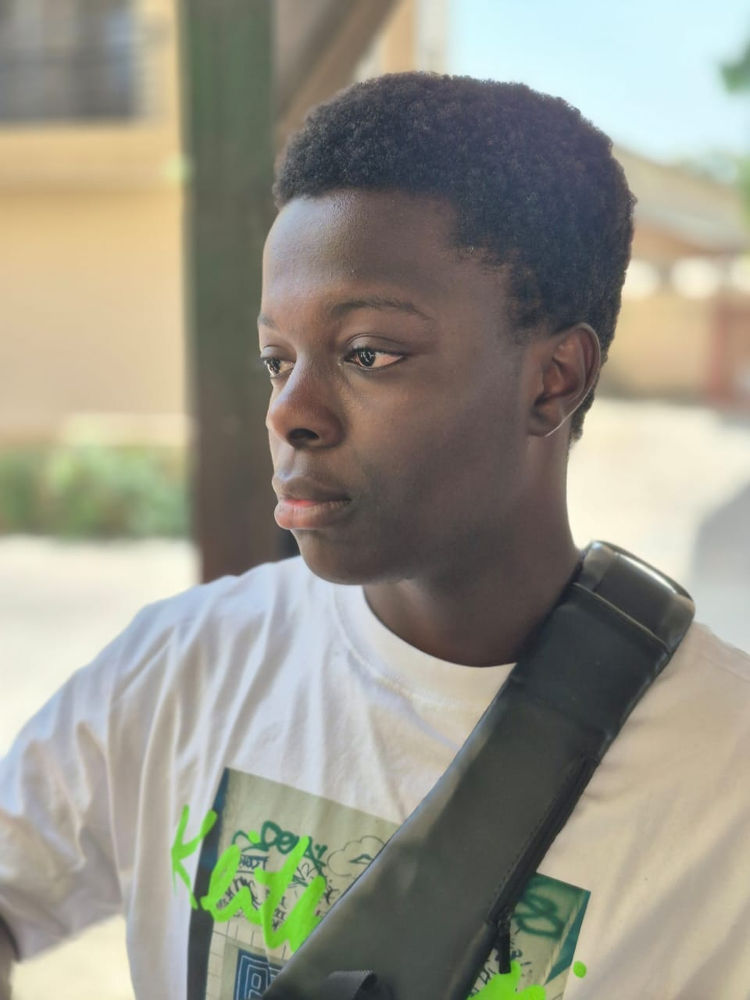

## About me
Hello there, I'm a high school student at [St. Marks Academy](https://www.stmarks.anthemtrust.uk/). I plan on doing aerospace engineering (more specifically aeronautical engineering). I'm a freelance developer, I have  3 years of experience with 3D modeling (mainly focusing on aircraft), including 2 years working on modeling the A350-1000 for X-plane 11. I also have experience with CAD, specifically using Onshape but getting used to FreeCAD. I've got experience with programming, like what I used to make this website (R language). I've used C# for Unity, Lua for X-plane, HTML & CSS for web design, and I'm currently learning C++ for potential app development and to use with X-Plane. I have done a lot of research and have an understanding of aeronautical engineering. I know the names and functions of the control surfaces, the formula of lift and the physics behind it, as well as how to navigate myself around the cockpit.

### Skills
The skills currently in my arsenal are:

  -3D-modeling
  
  -Programming
  
  -3D-Texturing
  
  -CAD Design
  
  -UI/UX design
  
  -Photography
  

## Persoanl Projects
I currently have a project for X-Plane 11. In this project I'm making model of the A350-1000 for people to use and explore the pleasure of the aircraft. I've been improving the model for better quality and performance in the simulator by exploring a bunch of papers on the A350-1000 systems, parts, and specification. I often post my progress on Xplane.org, which is a community website for X-plane users, the link to my page is [here](https://forums.x-plane.org/index.php?/profile/1064692-unknown__/). 

Once the modeling part is done, I plan to work on the "back-end" of the aircraft, basically all the code that will be needed for it to run as intended and as realistically as possible. After finishing the back-end portion of the aircraft, I'll move onto texturing the aircraft (making it look visually appealing).

I have another project I'll use called Unity (a game engine) to make a physics based flight simulator, and hopefully upload it onto steam. The aim of this project is to make a flight simulator with realistic physics and almost completely physics based, for the best immersion, and hopefully even rival X-plane 12 (the newest version of X-plane). Currently, I'm working on getting the physics to work as intended, the hardest part is figuring out how lift will work, so I look at other programs like Xfoil that gives accurate results for lift.